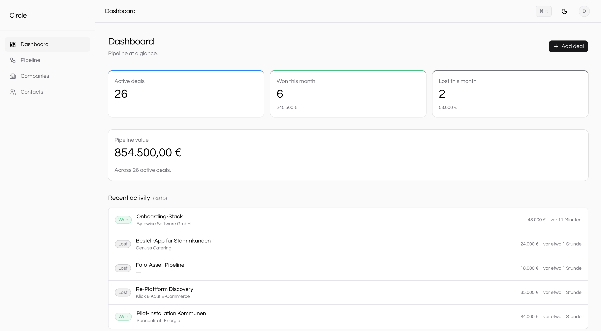
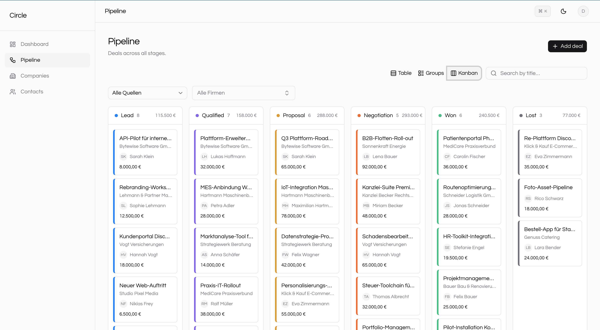
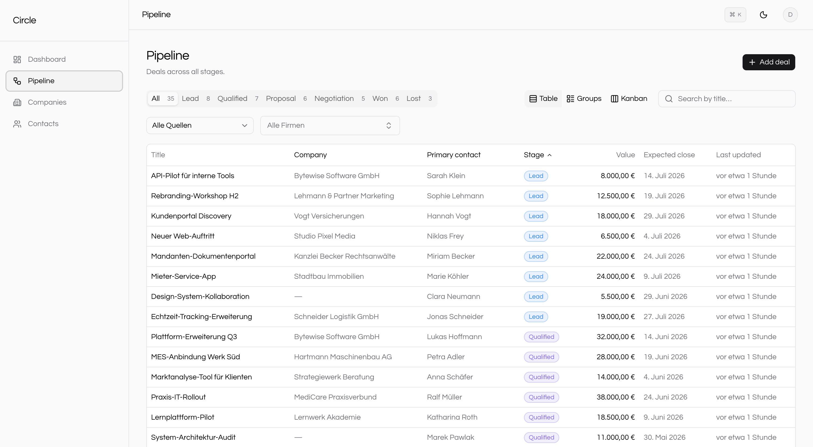
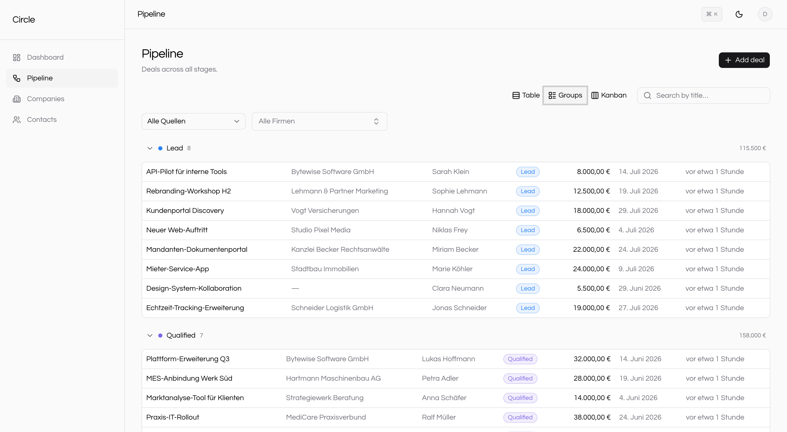
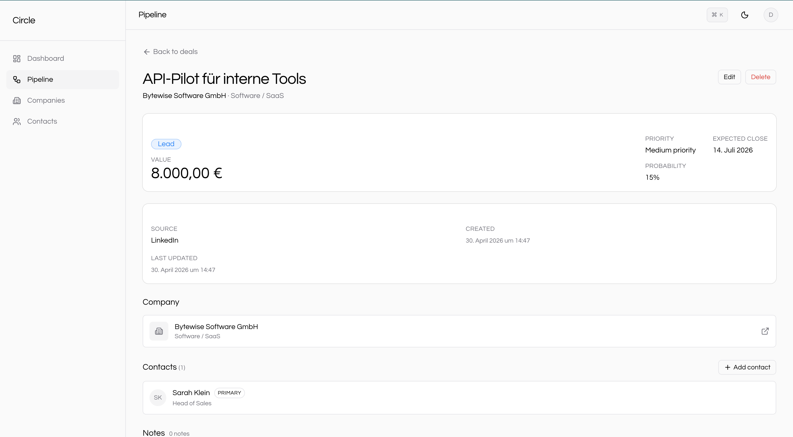
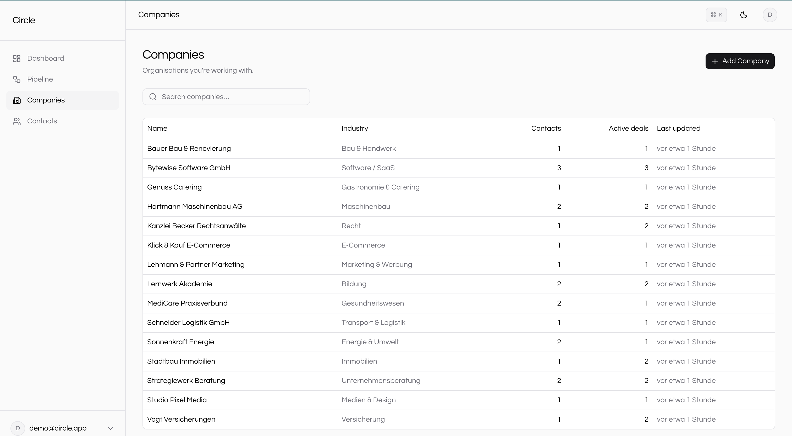
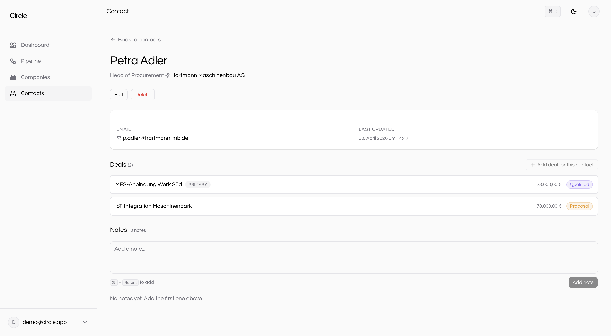

# Circle CRM

> A modern fullstack CRM with companies, contacts, deals, and a drag-and-drop pipeline.
> Built with Next.js 16, Supabase, TypeScript, and shadcn/ui.

[](https://crm.ibwayi.com)

## Demo

Visit [crm.ibwayi.com](https://crm.ibwayi.com) and click **Try as Demo User** for instant access — no signup needed.

The demo account resets every night at 03:00 UTC with realistic German B2B sales data: 15 companies, 27 contacts (including 5 freelancers), 35 deals across all 6 pipeline stages, and 10 polymorphic notes. Feel free to edit, drag, and delete — it'll all be back tomorrow.

## Features

- **Companies, Contacts, Deals** — proper CRM data model with M:N relationships via a `deal_contacts` junction.
- **Pipeline views** — Table, Groups, and Kanban over the same data, switchable per-user with localStorage persistence.
- **Drag-and-drop** across 6 deal stages (Lead → Qualified → Proposal → Negotiation → Won / Lost) with optimistic UI and automatic rollback on error.
- **Polymorphic notes** — attach a note to a Company, Contact, or Deal via a single shared component.
- **Dashboard** — pipeline value, won/lost counts (this month), and a recent activity feed.
- **Filters & search** — debounced search, source dropdown, company combobox, stage tabs. All state lives in URL searchParams so filtered views are shareable.
- **Inline create** — add a new Company or Contact directly from the deal form's combobox without leaving the dialog.
- **Dark mode** with persistent preference (`next-themes`).
- **Keyboard-friendly** — `⌘+Return` submits notes, comboboxes are searchable, dates accept manual `DD.MM.YYYY` typing alongside the calendar.
- **German B2B locale** — long date format ("15. April 2026"), EUR currency, sample data in German.

## Screenshots

### Dashboard


### Pipeline — Kanban


### Pipeline — Table


### Pipeline — Groups


### Deal detail


### Companies


### Contact detail


## Tech stack

| Layer | Choice |
|---|---|
| Framework | Next.js 16 (App Router, Server Components, Turbopack) |
| Language | TypeScript (strict, no `any`) |
| Database | Supabase (Postgres + RLS) |
| Auth | Supabase Auth (cookie-based SSR sessions) |
| UI | Tailwind CSS v4 + shadcn/ui (Base UI primitives) |
| Forms | react-hook-form + Zod 4 (`standardSchemaResolver`) |
| Drag-and-drop | `@dnd-kit/core` |
| Date picker | `react-day-picker` (shadcn Calendar) with manual-entry mask |
| Hosting | Vercel (Frankfurt edge, custom domain, nightly cron) |

## Architecture decisions

See [DECISIONS.md](./DECISIONS.md) for ADRs. Highlights:

- **Server actions over REST API routes** — type-safe RPC, `revalidatePath` lives next to the write.
- **Supabase RLS as the primary security boundary** — even API bugs can't leak data across users.
- **Polymorphic notes via three nullable FKs + CHECK constraint** — one table, three nullable parent columns, enforced "exactly one set."
- **M:N deal contacts with `is_primary` + partial unique index** — at most one primary per deal, no duplicate state.
- **Optional company on contacts and deals** — freelancers and one-off prospects are first-class.

## Local development

```bash
git clone https://github.com/ibwayi/circle-crm.git
cd circle-crm
pnpm install

# Configure Supabase
cp .env.example .env.local        # then fill in keys
# Apply migrations 0001 → 0009 in Supabase SQL editor
# Generate types: pnpm dlx supabase gen types typescript --project-id <ref> > types/database.ts

# Optional: seed the demo user with realistic data
pnpm seed

pnpm dev                          # http://localhost:3000
```

## Project structure

```
circle-crm/
├── app/
│   ├── (auth)/              login, signup, auth-side error boundary
│   ├── (app)/               protected routes — dashboard, companies, contacts, deals
│   ├── api/cron/reset-demo  nightly demo reset endpoint
│   ├── global-error.tsx     root-level fallback
│   └── layout.tsx
├── components/
│   ├── companies/           company-specific components
│   ├── contacts/            contact-specific components
│   ├── deals/               deal-specific components (table, groups, kanban, dialogs)
│   ├── dashboard/           dashboard cards + recent activity
│   ├── shared/              app shell (sidebar, topbar) + cross-entity primitives
│   └── ui/                  shadcn primitives (Base UI-backed)
├── lib/
│   ├── auth/                signOut server action
│   ├── db/                  typed query helpers (companies, contacts, deals, notes)
│   ├── seed/                shared demo data + seedDemoData()
│   ├── supabase/            browser, server, and proxy helpers
│   └── validations/         Zod schemas
├── supabase/migrations/     0001 → 0009 (init → companies → contacts → deals → notes → 2.0 cleanup)
├── scripts/seed-demo.ts     CLI wrapper around lib/seed/demo-data.ts
├── types/database.ts        generated by `supabase gen types`
└── proxy.ts                 Next 16 proxy — session refresh + auth redirects
```

## License

MIT — see [LICENSE](./LICENSE).
