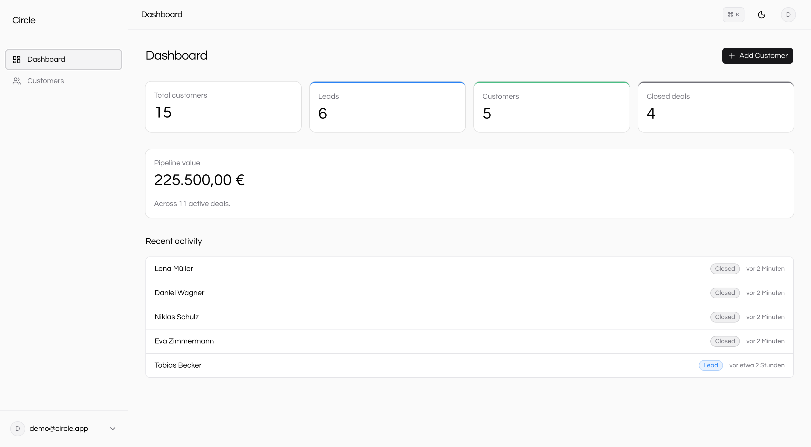
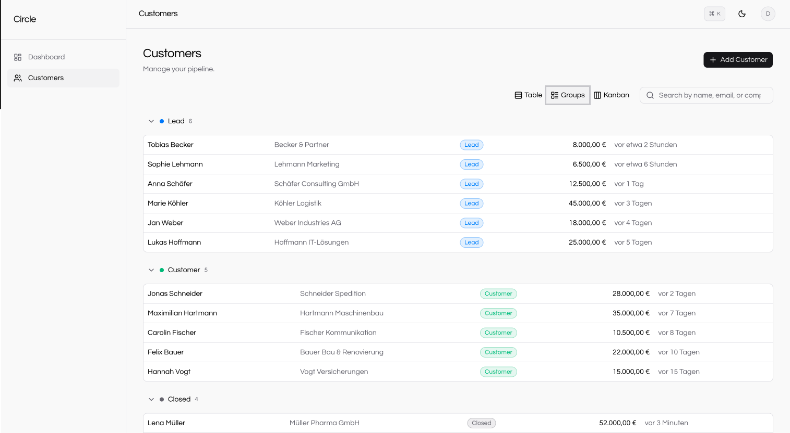
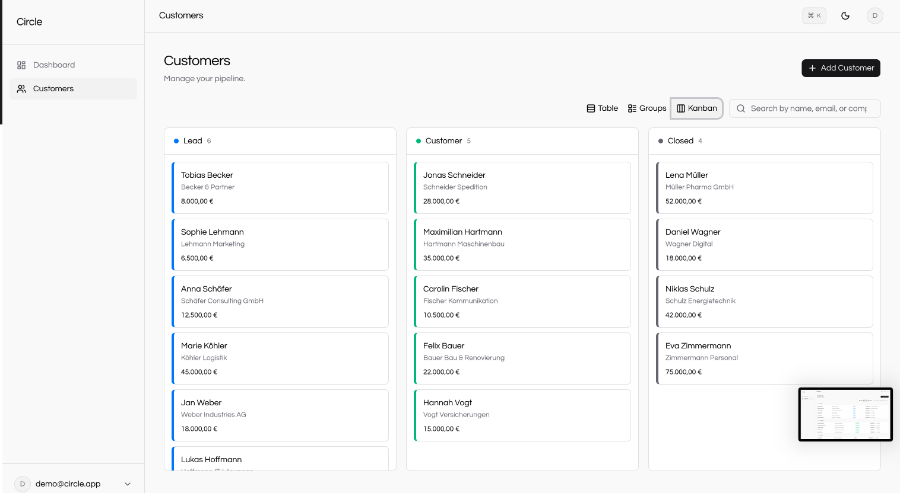
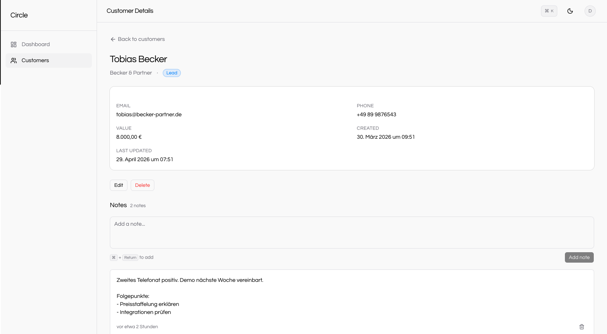

# Circle

> Modern fullstack CRM with Kanban, Groups, and Table views. Built with Next.js 16, Supabase, and TypeScript.



🔗 **Live demo:** [crm.ibwayi.com](https://crm.ibwayi.com) — click *Try as Demo User*, no signup needed
📦 **Repo:** [github.com/ibwayi/circle-crm](https://github.com/ibwayi/circle-crm)

---

## What it does

Circle is a clean, no-bullshit CRM for solo founders and small teams who actually want to open it. The same customer list renders three ways — a sortable table, Monday-style collapsible groups, and a drag-and-drop kanban — backed by Supabase Postgres with row-level security and end-to-end TypeScript from generated DB types to component props. Built as a portfolio piece in 2026 to show what a modern fullstack app looks like in production-feeling shape.

---

## Features

### Three views for the same data

- **Table view** — sortable, dense, classic CRM list with hover-revealed row actions.
- **Groups view** — Monday-inspired collapsible status sections, all expanded by default with per-section memory.
- **Kanban view** — drag-and-drop pipeline with three columns and optimistic status updates.



The view switcher is local to the user (localStorage). Filter, search, and sort all live in URL search params — share a filtered view with a link.

### Drag-and-drop that updates the database



Built on `@dnd-kit/core` with React 19's `useOptimistic` for the snap-to-new-column feel. On drop the card moves immediately, a server action persists the status change, and `revalidatePath` reconciles state. Drop on a failed update? The card snaps back automatically.

### Customer detail and notes



Edit and delete from a per-row menu or from the detail page. Per-customer notes with relative German timestamps and inline delete with a confirmation dialog. All mutations route through typed server actions.

### Dashboard

Pipeline value with German EUR formatting, per-status counts that link straight to a filtered customer list, and a recent activity feed showing the last five customers touched.

### Polish that's noticeable

- Dark mode with persistent preference (next-themes).
- Mobile-responsive — the table hides Company below sm and Last Updated below md; kanban becomes horizontal-scroll on phones.
- Empty states for every list, table, and column. No raw "no data" placeholders.
- Loading skeletons that match the loaded layout (no shift on hydration).
- Error boundaries with a friendly retry, including a global fallback.
- German-flavoured demo data that resets every night at 03:00 UTC.

---

## Tech stack

| Layer | Choice | Why |
|---|---|---|
| Framework | Next.js 16 (App Router) | Server Components by default, Server Actions for mutations, modern routing |
| Language | TypeScript (strict) | End-to-end type safety from DB to UI |
| Database | Supabase (Postgres) | Managed Postgres + auth + RLS in one service |
| Auth | Supabase Auth (SSR) | Cookie-based sessions, no token wrangling on the client |
| Styling | Tailwind CSS v4 + shadcn/ui (Base UI primitives) | Component library without lock-in |
| Validation | Zod 4 + Standard Schema | Runtime + compile-time schema validation, version-agnostic resolver |
| Drag-and-drop | @dnd-kit/core | Composable, accessible, optimistic-friendly |
| Forms | react-hook-form | Uncontrolled inputs, minimal re-renders |
| Deployment | Vercel | First-class Next.js platform; cron jobs for the nightly demo reset |

---

## Architecture

For the longer story, see [DECISIONS.md](./DECISIONS.md). The headlines:

- **Supabase + RLS** — security at the database layer, not the API layer. Even with API bugs, users cannot see each other's data ([ADR-001](./DECISIONS.md#adr-001-supabase--rls-over-a-custom-backend)).
- **Server Components by default** — data fetched server-side; client components only where interactivity demands them ([ADR-002](./DECISIONS.md#adr-002-nextjs-app-router-with-server-components)).
- **Server Actions for mutations** — type-safe RPC without API route boilerplate; `revalidatePath` lives in the same function that does the write ([ADR-004](./DECISIONS.md#adr-004-server-actions-instead-of-api-routes-for-mutations)).
- **Three views, one data array** — Table, Groups, Kanban each render the same `Customer[]` ([ADR-003](./DECISIONS.md#adr-003-three-customer-views-table-groups-kanban)).
- **No ORM** — Supabase's generated TypeScript types + the JS client are already type-safe; adding Drizzle/Prisma would be more moving parts for less safety.

---

## Try it

Easiest path: click *Try as Demo User* on the [live demo](https://crm.ibwayi.com). You're instantly signed in to a populated demo account — 15 German-flavoured customers across Lead/Customer/Closed, 10 notes with realistic content, dashboard pipeline stats. The data resets every night, so feel free to delete things.

Or run it locally:

### Prerequisites

- Node.js ≥ 20
- pnpm
- A Supabase project (free tier is fine)

### Setup

```bash
# Clone and install
git clone https://github.com/ibwayi/circle-crm.git
cd circle-crm
pnpm install

# Configure environment
cp .env.example .env.local
# Edit .env.local with your Supabase URL + keys
# (and optionally DEMO_USER_ID + CRON_SECRET for the demo reset flow)

# Apply database migrations
# Run supabase/migrations/0001_init_schema.sql then 0002_rls.sql in
# your Supabase SQL editor (or via the Supabase CLI).

# Generate TypeScript types from your live schema
pnpm dlx supabase gen types typescript --project-id YOUR_PROJECT_REF > types/database.ts

# Optional: seed the demo user with sample data
pnpm seed

# Start dev server
pnpm dev
```

Open [http://localhost:3000](http://localhost:3000).

---

## Project structure

```
circle-crm/
├── app/
│   ├── (auth)/              login + signup + auth-side error boundary
│   ├── (app)/               protected routes (dashboard, customers, detail)
│   ├── api/cron/reset-demo  nightly demo reset endpoint
│   ├── global-error.tsx     root-level fallback
│   └── layout.tsx
├── components/
│   ├── customers/           customer-specific components (table, kanban, dialogs)
│   ├── dashboard/           recent activity
│   ├── shared/              app shell (sidebar, topbar, theme toggle)
│   └── ui/                  shadcn primitives
├── lib/
│   ├── auth/                signOut server action
│   ├── db/                  typed query helpers (customers, notes)
│   ├── seed/                shared demo data + seedDemoData()
│   ├── supabase/            browser, server, and proxy helpers
│   └── validations/         Zod schemas
├── supabase/migrations/     0001_init_schema.sql, 0002_rls.sql
├── scripts/seed-demo.ts     CLI wrapper around lib/seed/demo-data.ts
├── types/database.ts        generated by `supabase gen types`
└── proxy.ts                 Next 16 proxy (formerly middleware) — session refresh + auth redirects
```

---

## License

MIT — see [LICENSE](./LICENSE).

---

## Acknowledgements

Built with [shadcn/ui](https://ui.shadcn.com), [@dnd-kit](https://dndkit.com), and [Supabase](https://supabase.com). Inspired by Monday.com's grouped tables and Linear's motion restraint.
